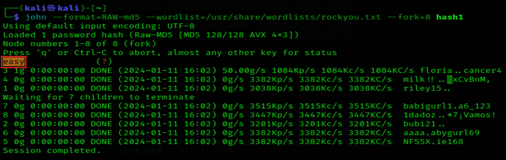
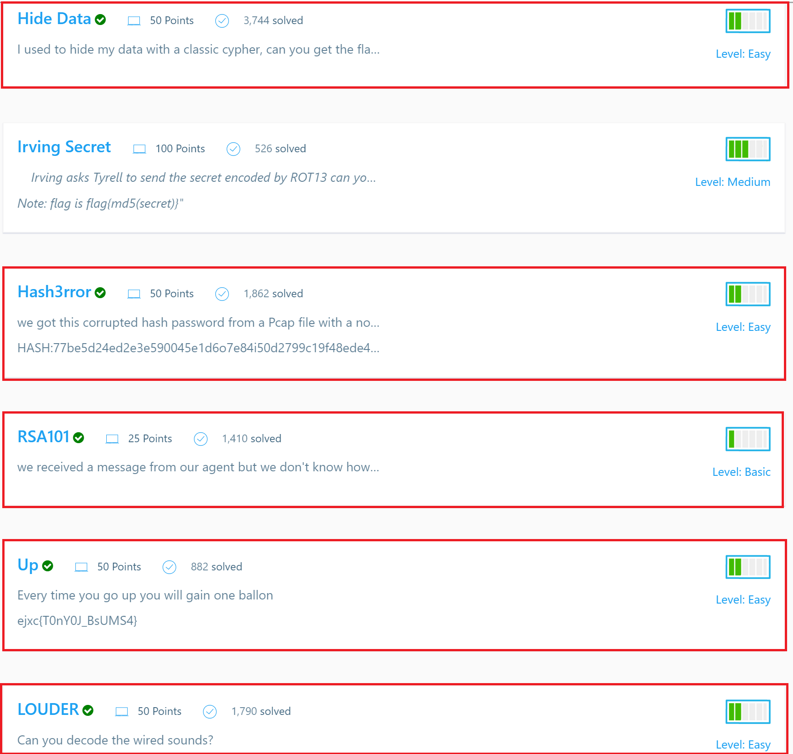

# THM Challenges
## Cryptography for Dummies
### Task 2  
- To Remind

- Solutions of the Task

### Task 3 
- Solutions of the Task

### Task 4
- Solutions of the Task:

# Introduction to Cryptography

### Task 1
1 - “Xjnvw lc sluxjmw jsqm wjpmcqbg jg wqcxqmnvw; xjzjmmjd lc wjpm sluxjmw jsqm bqccqm zqy.” Zlwvzjxj Zpcvcol

    You can guess that it is a quote. Who said it?
- we will use 'quipqiup' website to decrypt the received ciphertext.

- Solutions of the task:

***
### Task 2

1- Decrypt the file quote01 encrypted (using AES256) with the key s!kR3T55 using gpg. What is the third word in the file?

- we can encrypt the file using 'gpg' tool

- and if we want to decrypt it with using same tool we will write it as this:

 

2- Decrypt the file quote02 encrypted (using AES256-CBC) with the key s!kR3T55 using openssl. What is the third word in the file?

- too we can decrypt the files use 'openssl' 

- and to decrypt it we will use 'openssl' but with another command:

- To more secure we can use:

3- Decrypt the file quote03 encrypted (using CAMELLIA256) with the key s!kR3T55 using gpg. What is the third word in the file?

- Solutions of the task:

***
### Task 3
- we will use this commands to solve our challenges

1- Bob has received the file ciphertext_message sent to him from Alice. You can find the key you need in the same folder. What is the first word of the original plaintext?

- By using the command:
> sudo openssl pkeyutl -decrypt -in ciphertext_message -inkey private-key-bob.pem -out decryptedBobPrivateKey.txt

2- Take a look at Bob’s private RSA key. What is the last byte of p?
- We will open Bob’s private RSA key bytes to solve this challenge.

3- Take a look at Bob’s private RSA key. What is the last byte of q?

- Solutions of the task:

***
### Task 4
- Remember

1- A set of Diffie-Hellman parameters can be found in the file dhparam.pem. What is the size of the prime number in bits?
- we will use the next command to solve this challenge and get the size of primes number.
> openssl dhparam -in dhparams.pem -text -noout

2- What is the prime number’s last byte (least significant byte)?

- Solutions of the task:

***
### Task 5
1- What is the SHA256 checksum of the file order.json?

2- Open the file order.json and change the amount from 1000 to 9000. What is the new SHA256 checksum?

- For first Question we use command:
> sha256usm 'the file name'
- but in the second one we should to change the amount from 1000 to 9000 so we should to use:
>  nano 'the file name' 

Now we will change the amount and repeat what we did in the previous Question.

3- Using SHA256 and the key 3RfDFz82, what is the HMAC of order.txt?

- by using the command:
hmac256 "Key" "the name of the file"

> hmac256 3RfDFz82 order.txt

- Solutions of the task:

***
### Task 6

1- What is the size of the public key in bits?

2- Till which year is this certificate valid?

- To view the certificate we will use the command:
> openssl x509 -in cert.pem -tex

- Solutions of the task:

***
### Task 7

1- You were auditing a system when you discovered that the MD5 hash of the admin password is 3fc0a7acf087f549ac2b266baf94b8b1. What is the original password?

- We will sole this Question by using "CrackStation Website"

we will find thw solution is >> qwerty123

# Crack the hash
## Task 1

1- Can you complete the level 1 tasks by cracking the hashes?
### First hash
> 48bb6e862e54f2a795ffc4e541caed4d 

First we will make a file and  name it by hash1 and put the hash in it.then use 'hash-identifier' to know the type of the hash.

- To crack the file we will use john the ripper..

- the password will be >> easy 
***
### Second hash
> CBFDAC6008F9CAB4083784CBD1874F76618D2A97 

First we will make a file and name it by hash2 and put the hash in it.then use 'hash-identifier' to know the type of the hash.

- To crack the file we will use john the ripper..
 

- the password will be >> password123
***
### Third hash

> 1C8BFE8F801D79745C4631D09FFF36C82AA37FC4CCE4FC946683D7B336B63032

First we will make a file and name it by hash3 and put the hash in it.then use 'hash-identifier' to know the type of the hash.

- To crack the file we will use john the ripper.. 

- the password will be >> letmein
***
### Fourth hash

> $2y$12$Dwt1BZj6pcyc3Dy1FWZ5ieeUznr71EeNkJkUlypTsgbX1H68wsRom

We will use hashes.com site to get the password:

- the password will be >> bleh
***
### Fifth hash

> 279412f945939ba78ce0758d3fd83daa

We trying to crack this md4 hash by john the ripper but we didnt get any result so we will use the CrackStation site.

- the password will be >> Eternity22

Now we will display the solutions of task1

***
## Task 2

### First hash

>F09EDCB1FCEFC6DFB23DC3505A882655FF77375ED8AA2D1C13F640FCCC2D0C85

First we will make a file and name it by hash6 and put the hash in it.then use 'hash-identifier' to know the type of the hash.

- To crack the file we will use john the ripper..

- the password will be >> paule
***
### Second hash

> 1DFECA0C002AE40B8619ECF94819CC1B

- We will use hashes.com site to get the password

- the password will be >> n63umy8lkf4i
***
### Third hash

>$6$aReallyHardSalt$6WKUTqzqUQQmrm0pT7MPpMbGNnzXPMAXi4bJMl9be.cfi3/qxIf.hsGpS41BqMhSrHVXgMpdjS6xeKZAs02.

- We will use hashes.com site to get the password

- the password will be >> waka99
***

### Fourth hash

> e5d8870e5bdd26602cab8dbe07a942c8669e56d6

- We will use hashes.com site to get the password

- the password will be >> 481616481616

Now we will display the solutions of task2

***

# CyberTalents
###  Crack the Hash

1- A hacker leaked the below hash online.Can you crack it to know the password of the CEO?

> 1ab566b9fa5c0297295743e7c2a6ec27

- We will use hashes.com site to get the password

- the password will be >> Iamtheflag
***

###  Guess The Password

2- A hacker leaked the below hash online.Can you crack it to know the password of the CEO? the flag is the password Hash:

 > 06f8aa28b9237866e3e289f18ade19e1736d809d
 
 - We will use hashes.com site to get the password

 

 - the password will be >> jrahyn+
***

### Hide Data

- the password will be >> 2j68yfhqlz 

### Hash3rror
>77be5d24ed2e3e590045e1d6o7e84i50d2799c19f48ede46804a8734e287df120f
- the hash numbers is (0,1,2,3,4,5,6,7,8,9) and characters is (a,b,c,d,e,f) so we need to reduce this hash to be suitable with the true hash. if we do this we will delete (i,o)
- we will get a sha256 hash :
>77be5d24ed2e3e590045e1d67e8450d2799c19f48ede46804a8734e287df120f

- Now we will use hashes.com to get the password:

- Now he need sha1 hash of this password so we will use cyberchef site to make it:

- the password will be >> 83874343435092cb681c0d558a84bfeb389c32ed 
***
### RSA101or

- the password will be >> flag{RSA_nice_try}
***
### Up
- in this challenge we will increase every character by one to the next one and stay increase it by one to get the next character

***
### LOUDER

***

- Solutions of all CyberTalents Tasks:

thanks.....